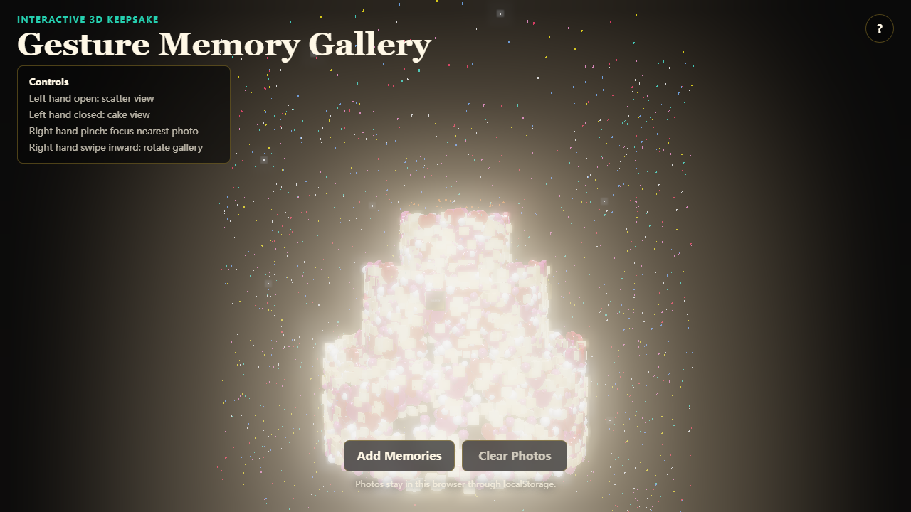
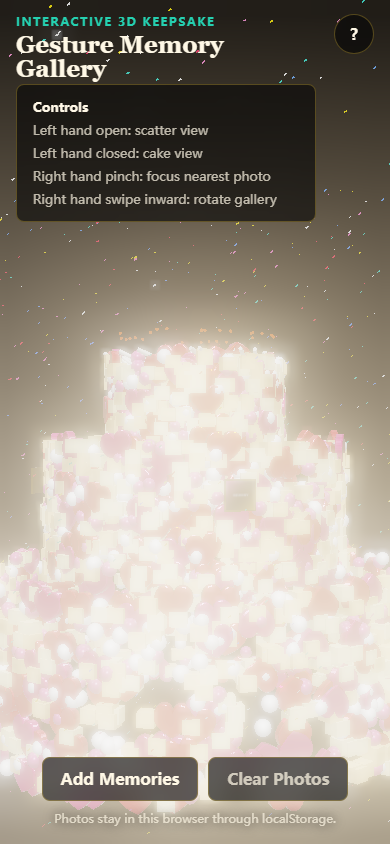

# Gesture Memory Gallery

Gesture Memory Gallery is a browser-based interactive keepsake app. It turns uploaded photos into a 3D memory gallery, then lets users switch views, rotate the scene, and focus photos through hand gestures.

The original idea came from a personalized birthday greeting page. This version is organized as a recruiting-ready small project: the private celebration context is separated from the reusable technical design, so the project can be discussed as a WebGL interaction prototype.

## Preview

Desktop view:



Mobile view:



## Features

- 3D particle scene built with Three.js.
- Cake, scatter, and photo-focus interaction modes.
- MediaPipe HandLandmarker integration for browser-side gesture recognition.
- Left-hand open/closed gesture for mode switching.
- Right-hand pinch gesture for nearest-photo focus.
- Right-hand inward swipe gesture for gallery rotation.
- Multi-image upload with Canvas compression.
- localStorage persistence, keeping photos in the user's browser instead of uploading them to a server.
- Responsive overlay controls and camera preview.

## Tech Stack

- Vite
- Three.js
- MediaPipe Tasks Vision
- Vanilla JavaScript modules
- Canvas API
- localStorage

## Project Structure

```text
gesture-memory-gallery/
  index.html
  src/
    main.js
    config.js
    styles.css
    scene/
      Experience.js
      Particle.js
    storage/
      photoStorage.js
    vision/
      HandGestureController.js
  docs/
    recruiting-positioning.md
```

## Run Locally

```bash
npm install
npm run dev
```

Then open the local URL printed by Vite, usually:

```text
http://127.0.0.1:5178/
```

Do not open `index.html` directly from the file system. The app uses JavaScript modules and third-party packages, so it should be served through Vite.

Camera access requires a secure context or localhost. If no camera is available, the app still shows the 3D scene and upload controls, while gesture control is disabled.

## Build

```bash
npm run build
```

## Implementation Notes

The app models visual elements as particles with shared update behavior. Each particle owns a mesh, current position, target position, velocity, and mode-specific parameters. The scene state switches between `CAKE`, `SCATTER`, and `FOCUS`, while particles interpolate toward their current target positions to keep transitions smooth.

Hand gestures are processed fully in the browser. The left side of the mirrored camera frame is used for mode switching, and the right side is used for photo interaction. Pinch distance between thumb and index finger controls photo focus, while filtered palm movement adds rotational velocity to the gallery.

Uploaded images are compressed through Canvas before being saved to localStorage. This keeps the demo lightweight and avoids server-side storage of personal images.

## Recruiting Summary

This project is best positioned as a small frontend / creative coding project. It demonstrates:

- Translating a user scenario into an interactive product prototype.
- Building modular browser-side code from a single creative concept.
- Integrating WebGL rendering with real-time computer vision input.
- Thinking about privacy and storage boundaries for user-uploaded media.

For non-technical roles such as supply chain, procurement, or operations, this should be treated as a bonus project rather than a core business project. It can support a broader story about digital literacy, structured problem decomposition, and fast prototyping.
